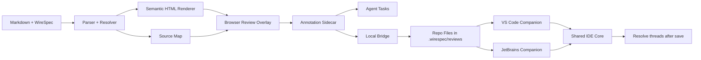

# WireSpec

**WireSpec** is a Markdown-native, agent-friendly UI specification system for designing screens before coding agents implement them.

It is built to solve a practical problem: coding agents can generate UI quickly, but they often build the wrong thing when the intended structure, states, hierarchy, and interaction details are underspecified. WireSpec puts a low-fidelity, reviewable, deterministic UI spec in the middle of the workflow so humans and agents can align before implementation.

The full solution is larger than a Markdown grammar. It includes:

- a WireSpec authoring language
- a parser, resolver, and semantic renderer
- a browser review layer with structured annotations
- a local bridge that persists review state into the repo
- agent-task exports
- IDE companions that surface and resolve review work

## What problem this solves

Teams using coding agents for UI work often hit the same failure mode:

1. the prompt describes a screen too loosely
2. the agent generates a plausible but wrong UI
3. feedback arrives late, after code structure has hardened
4. the team either patches the wrong foundation or starts over

WireSpec changes that loop.

Instead of going straight from prose to implementation, the workflow becomes:

1. describe the screen in Markdown + WireSpec
2. render a low-fidelity preview
3. review it in the browser at page, section, and element level
4. save feedback as structured review threads
5. export bounded tasks for the coding agent
6. implement and resolve review items in the IDE

## Product principles

### Low fidelity first
WireSpec is for structure, hierarchy, states, flows, and task fit. It is not trying to replace high-fidelity product design tools.

### Semantic over pixel-based
The language describes intent and layout semantics, not absolute positioning or bespoke styling.

### Readable by humans, deterministic for agents
The source must stay comfortable in Markdown, but rigid enough that an agent can edit it without drifting into improvisation.

### Review is first-class, but separate
Annotations and review threads are essential to the workflow, but they do not live inside the core structural tree. They live in sidecars and runtime overlays.

### Preview stays primary
Review and IDE utilities follow the same restraint: no fake dashboards, no filler collaboration chrome, no ornamental sidebars. This stays aligned with the Proper UI guidance used throughout the solution.

## End-to-end solution

### 1. Authoring layer
A screen is written as a normal Markdown document with:

- optional frontmatter
- normal prose such as intent and acceptance
- one base `wirespec` fenced block
- optional variant blocks for state, breakpoint, theme, or mode

Example:

````md
---
id: login
route: /login
component: src/features/auth/LoginCard.tsx
---

# Login

## Intent
Allow a returning user to sign in quickly.

```wirespec v=1 kind=base
screen id=login route="/login" title="Sign in"
  main id=content align=center justify=center padding=lg
    card id=auth-card max=sm
      heading id=title level=1 text="Welcome back"
      form id=login-form submit=sign-in
        field id=email type=email name=email label="Work email" required=true
        field id=password type=password name=password label="Password" required=true
        actions id=primary-actions
          button id=submit variant=primary action=submit label="Sign in"
```

```wirespec v=1 kind=state name=loading
patch target=submit label="Signing in…" busy=true disabled=true
patch target=login-form disabled=true
```
````

### 2. Compile and render layer
The parser reads the Markdown host document, extracts `wirespec` fences, validates structure, resolves selected variants, and renders restrained semantic HTML.

The renderer emits stable hooks such as:

- `data-ws-screen`
- `data-ws-id`
- `data-ws-kind`
- `data-ws-target`
- `data-ws-role`

These hooks make it possible to target page, section, and element feedback without tying the review layer to visual CSS details.

### 3. Review layer
A reviewer opens the rendered preview in the browser and can leave structured feedback on:

- the full page
- a section
- an element
- prose
- acceptance criteria

Threads are stored in a JSON sidecar instead of being mixed into the WireSpec tree.

Each thread includes semantic anchors, lifecycle metadata, severity, category, messages, and optional proposed patches.

### 4. Local bridge
A small localhost bridge turns browser review into repo files.

By default it writes:

- `.wirespec/reviews/<documentId>.annotations.json`
- `.wirespec/reviews/<documentId>.agent-tasks.json`
- `.wirespec/reviews/events.ndjson`

This is the handoff point from browser review to terminal or IDE automation.

### 5. Agent-task layer
Open review threads are normalized into bounded tasks with:

- target id
- target scope
- variant key
- severity
- taxonomy
- source location when available
- requested change summary

This lets a coding agent work from explicit, review-backed UI tasks instead of interpreting a screenshot or freeform comment dump.

### 6. IDE companions
The IDE layer is intentionally thin.

It watches task files, opens relevant targets, tracks changed line ranges, and resolves matching review threads when the target file is edited and saved.

The current stack includes:

- a VS Code companion
- a shared cross-IDE core
- a JetBrains thin companion skeleton over the shared core

## Architecture



## Core file formats

### WireSpec document
The Markdown source of truth for a screen or component.

### AST
A parsed, validated representation of the structural tree and variant operations.

### Source map
A target index that maps page, section, element, prose, and acceptance items back to source spans and stable semantic identifiers.

### Annotation sidecar
The canonical storage format for review threads.

### Agent tasks
A normalized export of open review work for terminal and IDE agents.

### Audit log
An NDJSON append-only log of bridge and IDE events.

## Current implementation status

### Language and specification
- v1 draft exists
- v1 rc0 grammar and AST schema exist
- core vocabulary is frozen for v1
- 10 canonical reference screens exist

### Parser and rendering
- Markdown host parser exists
- variant resolver exists
- semantic HTML renderer exists
- target source-map generation exists
- review overlay hooks exist

### Review and annotations
- annotation sidecar model exists
- browser review runtime exists
- import/export exists
- local persistence exists
- relinking support exists

### Bridge and automation
- local bridge server exists
- browser save/load exists
- SSE event stream exists
- terminal watcher exists
- agent-task export exists

### IDE workflow
- VS Code companion exists
- save-driven resolution exists
- shared cross-IDE core exists
- JetBrains thin companion skeleton exists

## Honest status

This is already a coherent reference solution, but not every layer is equally mature.

Most complete today:

- WireSpec authoring direction
- parser / resolver / renderer reference implementation
- browser review runtime
- local bridge
- VS Code workflow
- shared cross-IDE core

Less complete today:

- full lint packs for UX, accessibility, and component semantics
- canonical formatter / writer
- production-grade multiplayer review
- full packaging and distribution for IDE integrations
- compiled JetBrains plugin artifact
- final code-generation adapters

## Canonical screen fixtures

The solution includes 10 canonical screens that act as parser, renderer, review, and agent-edit fixtures:

- Login
- Workspace onboarding
- Knowledge search
- Fulfillment queue
- Case detail
- Security settings
- Checkout
- Clinic scheduler
- Support conversation
- Article editor

These are intentionally task-first and avoid generic dashboard filler.

## Suggested monorepo layout

```text
wirespec/
  packages/
    language/
      grammar/
      schema/
      fixtures/
    parser-renderer/
    review-runtime/
    local-bridge/
    ide-core/
    vscode/
    jetbrains/
  examples/
    screens/
    outputs/
  docs/
    architecture/
    workflows/
    authoring/
```

## How an agent should use WireSpec

A coding agent should not jump straight from a feature brief to implementation code.

Recommended workflow:

1. read the WireSpec document
2. inspect the selected state and breakpoint variants
3. read open annotation sidecars and agent tasks
4. implement only the bounded target changes
5. update the relevant target file
6. let the IDE companion resolve touched review threads on save

This is the core value of WireSpec: the agent works against an explicit UI contract and explicit feedback targets.

## Review model

Annotations are part of the product, but they are not embedded into the core syntax.

That split is intentional:

- the structural tree stays deterministic
- review stays expressive and collaborative
- agents can consume comments as structured work instead of parsing prose from the main source

Supported review scopes:

- screen
- section
- element
- prose
- acceptance
- region fallback

## Why this is better than prompt-only UI generation

Prompt-only UI generation tends to collapse several important activities into one step:

- deciding the right structure
- deciding states and edge cases
- deciding terminology
- implementing the code

WireSpec separates those concerns so they can be reviewed in the right order.

That produces a better loop for coding agents:

- less guesswork
- less rework
- clearer diffs
- bounded review tasks
- better traceability from feedback to implementation

## Non-goals

WireSpec is not trying to be:

- a full visual design tool
- a pixel-perfect prototyping system
- a replacement for Figma, Penpot, or Storybook
- a general-purpose HTML templating language
- a freeform canvas markup language inside the core spec

## Roadmap

### Near-term
- merge the current reference packs into one coherent repo
- add a canonical formatter
- add lint packs for accessibility, semantics, and UX quality
- connect browser review saves directly to repo state by default
- harden the shared IDE core and companion configs

### Mid-term
- add code adapters for target frameworks
- add Storybook export
- add CI validation for grammar, AST, and review integrity
- complete JetBrains packaging and distribution

### Later
- richer design-system bindings
- optional design-tool bridges
- multi-user review presence and conflict handling
- stronger automated patch suggestions from annotations

## Package map for the current workspace

This full solution was built incrementally across reference packages. In the current workspace, the major slices are:

- `wirespec_v1_reference_pack`
- `wirespec_v1_continuation`
- `wirespec_annotation_continuation`
- `wirespec_annotation_runtime_v0_1`
- `wirespec_parser_renderer_adapter_v0_1`
- `wirespec_review_runtime_v0_2`
- `wirespec_local_bridge_v0_3`
- `wirespec_vscode_ide_companion_v0_4`
- `wirespec_cross_ide_companions_v0_5`

A practical next step is consolidating them into a single monorepo with one root package map, one docs site, and one release story.

## Summary

WireSpec is not just a Markdown extension.

It is a full reviewable UI-spec workflow for coding agents:

- author the UI structurally in Markdown
- render and review it before coding
- annotate it at page, section, and element level
- persist feedback as structured repo data
- export bounded tasks for agents
- resolve threads automatically as implementation changes land

That is the full solution.
